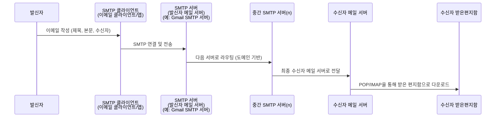

## 메일 서버

일반적으로 이메일을 수신, 발신, 전달하는 서버를 통칭하는 용어이다.

## SMTP 서버

메일 서버 중 '발신'에 집중하는 서버를 의미한다. '발신 메일 서버'라고 부르기도 한다.

### 예시: Gmail용 SMTP 서버란?

smtp.gmail.com 주소를 갖는다. \
Gmail 을 사용해 이메일을 보내도록 이메일 클라이언트 또는 서버를 구성할 때 일반적으로 이 SMTP 서버 주소를 사용한다.

## 발신/수신 과정

발신자의 이메일 클라이언트 또는 서버는 ‘SMTP 클라이언트’ 역할을 하고 발신자의 이메일 서버는 ‘SMTP 서버’ 역할을 한다.
SMTP 클라이언트는 SMTP 서버와 연결을 시작하고 수신자 세부 정보, 제목, 본문이 포함된 이메일을 전송한다. SMTP 서버는 이 이메일을 처리하는데, 처리한다는 의미는 수신자 주소를 기반으로 적절한 ‘다음 서버’를 결정해 전송하는 것을 의미한다. \

여기서 ‘다음 서버’ 는, 다른 SMTP 서버일 수도 있고 최종 대상, 즉 수신자의 메일 서버일 수도 있다.
메시지가 받는 사람의 서버에 도착하면 POP 또는 IMAP 같은 다른 프로토콜을 사용해 받는 사람의 받은 편지함으로 전달된다.

### POP3(Post Office Protocol 3)

이메일을 수신할 때 사용하는 프로토콜. 이메일이 메일 서버에 도착하면 서버로부터(구체적으로는 큐 역할을 하는 서버의 사서함) 메일을 다운로드한다. 다운로드 시 헤더, 본문을 모두 다운로드한다. \
다운로드와 동시에 메일 서버의 이메일 데이터는 삭제한다. (삭제하지 않도록 설정할 수도 있다고 한다.)

즉, POP3 방식으로 이메일을 수신하면 로컬 PC에 이메일 데이터를 다운로드 받는 형식이다. 메일 서버에서 데이터가 삭제됐다면 다른 기기에서 그 이메일 데이터를 확인할 수 없다.

### IMAP(Internet Message Access Protocol)

마찬가지로 이메일을 수신하기 위해 사용하는 프로토콜. IMAP 의 경우 메일 서버와 동기화되는 방식으로 스마트폰, 태블릿, PC 등 다양한 클라이언트에서 확인이 가능하다. 대표적인 예로, 여러 기기에서 ‘받은 편지함’, ‘보낸 편지함’ 을 확인해 동일한 데이터들을 확인할 수 있다.

메일 서버와 연결(접속)해 이메일 데이터를 확인하는 방식으로, 메일 열람 후에도 서버에 메일이 유지된다. (즉, 서버에서 메일을 관리해주는 것이다.) 수신자에게 메일을 보여줄 때 메일의 헤더만 보여주고 메일을 클릭할 때 메일 내용과 본문을 다운로드 하는 방식으로 구성할 수 있다. (성능/안정성을 고민하면 자연스럽게 이런 구성이 되겠다.) \
메일 서버의 트래픽이 높고, 오프라인 상태에서는 메일을 확인할 수 없다고 한다. 받은 메일함의 용량이 곧 서버의 용량이기 때문에 용량 제한 등 용량 관리가 필요하다.

아마도 근래의 이메일 서비스는 IMAP, POP3 방식을 함께 사용하겠다. 최근 N일, N개의 이메일은 POP3 프로토콜 기반으로 처리하고, 그보다 오래된 이메일(접근성이 떨어지는 이메일)은 IMAP 방식으로 처리하는 구성 처럼 말이다.

> 휴대폰에서 Gmail 앱에서 인터넷 연결을 끊고, 검색 기능을 사용하려 하면 "오프라인입니다. 제한된 수의 검색결과가 표시됩니다." 라는 메시지를 확인할 수 있는데 아마도 위의 구성이지 않을까 싶다.

## 참고

* https://aws.amazon.com/ko/what-is/smtp/
